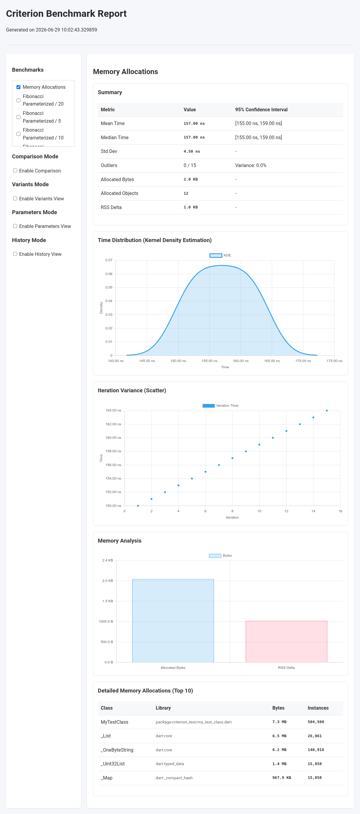
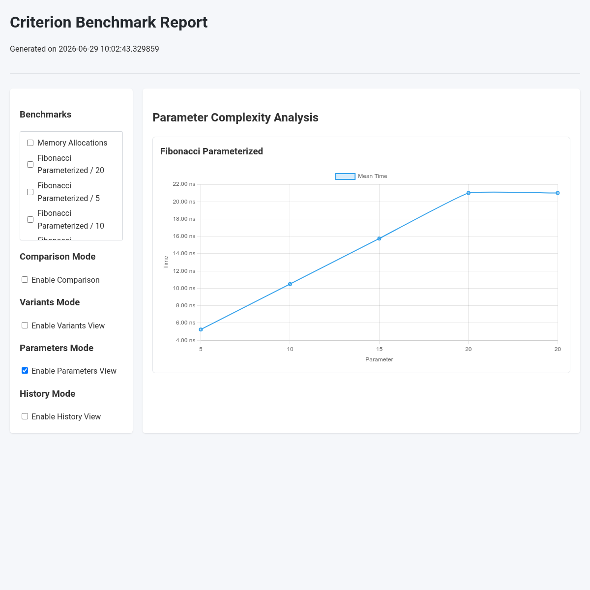
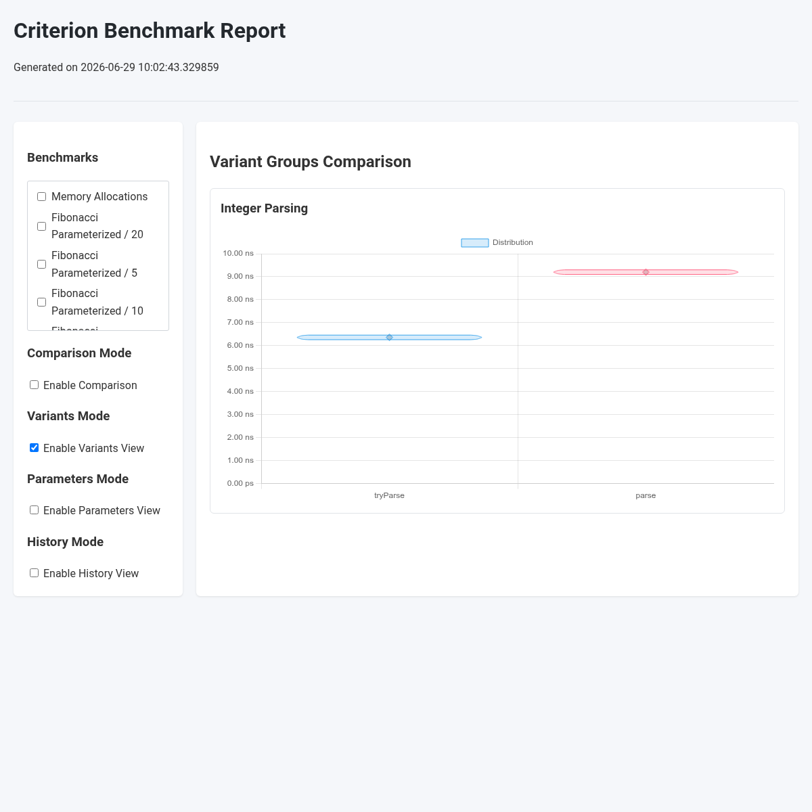
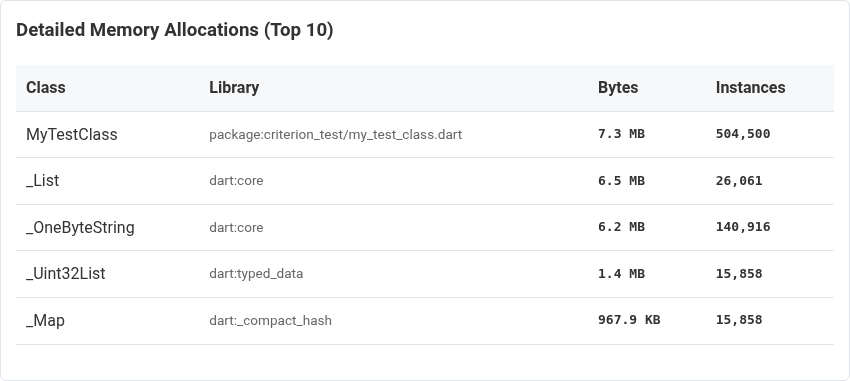
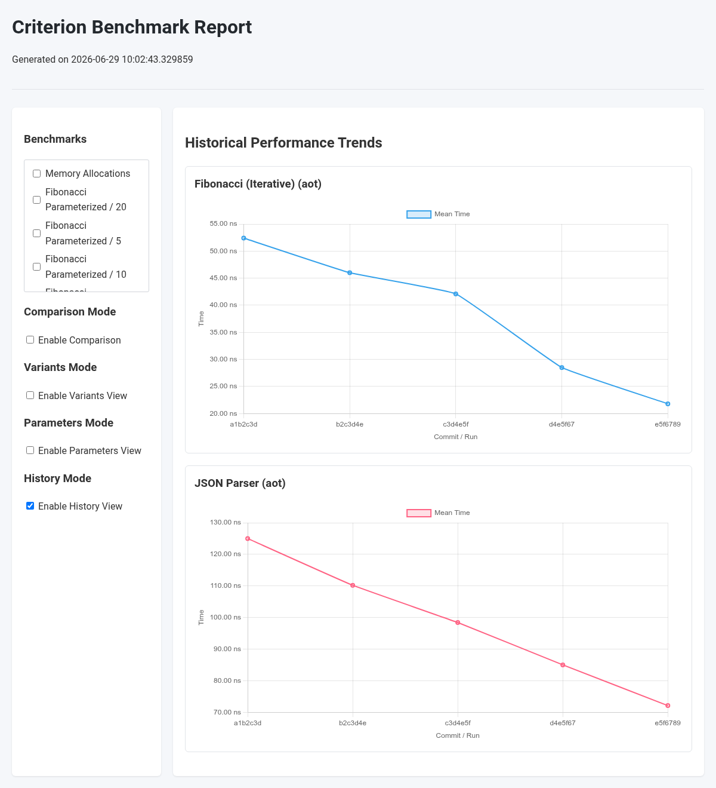
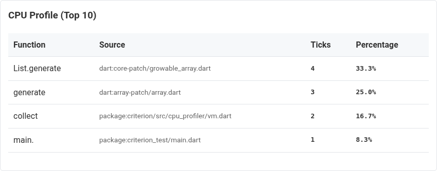

# Criterion

A statistics-driven benchmarking library for Dart, inspired by Rust's `criterion.rs`.

Criterion helps write precise benchmarks by accounting for JIT warm-up, garbage collection, and system noise.

## Features

*   **Robust Statistics**: Estimates 95% confidence intervals for mean and median using bootstrapping.
*   **Outlier Analysis**: Detects outliers and calculates their impact on variance.
*   **Adaptive Warm-up**: Automatically calibrates iterations. Supports KBSSD (Kernel-Based Steady-State Detection).
*   **Parameterization**: Run the same benchmark over a range of inputs and plot complexity.
*   **Resource Tracking**: Measures allocated bytes, object counts, RSS delta, and **detailed class-level allocations**.
*   **CPU Cycles**: Counts CPU cycles using hardware performance counters (FFI-based).
*   **CPU Instructions**: Counts CPU instructions on Linux (requires performance counter access).
*   **CPU Profiling**: Optional CPU sampling profiling with Dart DevTools integration.
*   **Historical Tracking**: Local database to detect regressions automatically.
*   **Overhead Calibration**: Subtracts baseline harness overhead (e.g., FFI boundary cost).
*   **State Isolation**: Run setup functions outside the measured loop.
*   **Throughput Tracking**: Measures performance in bytes/second or elements/second.
*   **Async Support**: Native support for asynchronous benchmarks.
*   **Interactive Reports**: Generates HTML reports with charts (line, bar, violin, KDE, scatter) and exports raw JSON.

---

## Getting Started

Add `criterion` to your development dependencies:

```bash
dart pub add dev:criterion
```

---

## Usage

### Basic Benchmark

```dart
import 'package:criterion/criterion.dart';

int fib(int n) => n <= 1 ? n : fib(n - 1) + fib(n - 2);

void main() async {
  await criterion('Fibonacci', (c) {
    c.bench('fib(10)', () => fib(10));
    c.bench('fib(20)', () => fib(20));
  });
}
```

### Running Benchmarks

#### Multi-Runtime Runner (Recommended)
Run benchmarks in different execution flavors (JIT, AOT, JS, WASM):

```bash
# Run in default AOT flavor
dart run criterion:run benchmark/my_benchmark.dart

# Compare JIT and AOT
dart run criterion:run -f jit -f aot benchmark/my_benchmark.dart

# Compare JS and WASM (requires Node.js)
dart run criterion:run -f js -f wasm benchmark/my_benchmark.dart
```

Options:
*   `-f, --flavor`: `jit`, `aot`, `js`, or `wasm` (can be comma-separated or specified multiple times).
*   `--json`: Output results as JSON to stdout.
*   `--compiler-flag`: Extra flags for `dart compile`.
*   `--vm-flag`: Extra flags for Dart VM or Node.js.

#### Direct JIT Execution
```bash
dart benchmark/my_benchmark.dart
```

### Async Benchmarks
Benchmark functions can return a `Future`:

```dart
c.bench('async operation', () async {
  await someAsyncWork();
});
```

### State Isolation (Setup)
To benchmark operations that modify state (like in-place sorting) without measuring the setup time, use `setup`:

```dart
c.bench<List<int>>(
  'in-place sort',
  (list) => list.sort(),
  setup: () => List<int>.generate(1000, (i) => 1000 - i),
);
```
*Note: The benchmark function must accept the state returned by `setup`.*

### Throughput Tracking
Track performance relative to data size:

```dart
final data = Uint8List(1024 * 1024); // 1 MB
c.bench(
  'parse 1MB',
  () => parse(data),
  throughput: Throughput.bytes(data.length),
);
```

### Benchmark Variants
Compare multiple implementations of the same task:

```dart
c.variants<String>('Integer Parsing', {
  'tryParse': (s) => int.tryParse(s),
  'parse': (s) => int.parse(s),
}, setup: () => '123');
```
This prints a comparison table using the first variant as the baseline and adds a comparison chart to the HTML report.

### Parameterization (Value Benchmarking)

Run the same benchmark over a range of inputs (e.g., to verify algorithmic complexity):

```dart
c.benchWith<void, int>(
  'Fibonacci Parameterized',
  [5, 10, 15, 20],
  (n) => fib(n),
);
```

This groups the results in the report and generates a **Time vs. Parameter Value** line chart in the HTML report.

### CPU Profiling

Enable CPU profiling to identify bottlenecks:

```dart
await criterion('My Suite', (c) {
  c.bench('my-bench', () => work());
}, config: CriterionConfig(
  cpuProfiling: true, // Enable CPU profiling (adds overhead)
));
```

When enabled, Criterion will:
1. Print the top CPU-consuming functions in the console.
2. Add a CPU Profile table to the HTML report.
3. Export a raw Dart VM CPU profile to `<reportDir>/profiles/<name>.cpuprofile.json`. You can load this file into **Dart DevTools** (CPU Profiler tab) for full flamegraph analysis.

### Overhead Calibration
Subtract harness or FFI overhead using `noOp`:

```dart
c.bench(
  'strlen (1000 chars)',
  () => strlen(str1000),
  noOp: () => strlen(strEmpty),
);
```

### Preventing Dead-Code Elimination (DCE)
Compilers may optimize away pure functions if their results are unused. Pass results to `blackhole` to force execution:

```dart
c.bench('with blackhole', () {
  blackhole(pureFunction(10));
});
```

---

## Configuration

Configure the suite by passing `CriterionConfig`:

```dart
await criterion(
  'My Suite',
  (c) { ... },
  config: CriterionConfig(
    generateHtmlReport: true,
    exportJson: true,
    reportDir: 'benchmark/report',
    
    // KBSSD (Kernel-Based Steady-State Detection)
    useKbssd: true,                  // Use KBSSD adaptive benchmarking (default: true)
    kbssdWindowSize: 15,
    kbssdStabilityRequired: 8,
  ),
);
```

### KBSSD Adaptive Benchmarking
By default, Criterion uses KBSSD to detect convergence dynamically. It monitors a sliding window of measurements and stops when the variance stabilizes, saving time for fast-converging benchmarks while ensuring stability for noisy ones. You can disable it by setting `useKbssd: false` in the configuration.

---

## Comparing Results

### Comparing JSON Files
Compare two saved JSON reports:

```bash
dart run criterion:compare before.json after.json
```
Prints a Markdown table comparing time, memory, and instructions, with statistical significance checks.

### Git Reference Comparison
Automate comparison between two Git references (commits, branches, or tags):

```bash
dart run criterion:compare_git main feature-branch benchmark/my_benchmark.dart
```
This checks out both references to temporary worktrees, runs the benchmarks, and outputs the comparison.

### Historical Tracking & Regression Detection

Criterion can keep a history of benchmark runs to detect performance regressions automatically.

Configure it in your suite:

```dart
await criterion('My Suite', (c) { ... }, 
  config: CriterionConfig(
    checkRegressions: true, // Enable regression checks against history
    historyFile: 'benchmark/criterion_history.json', // Custom history file path
  ),
);
```

When `checkRegressions` is enabled, Criterion will compare the current run against the latest historical baseline. If a benchmark is statistically significantly slower (based on non-overlapping 95% confidence intervals of the mean), it will print a warning:

```text
  WARNING: Regression detected!
  Mean time increased by +24.5% (from 10.2ns to 12.7ns)
```

#### Workflows

There are three main workflows for managing baseline history and regression checks:

##### 1. Local Cache (Default)
Keep the history file local to track your development progress.
*   **Setup**: Add `benchmark/criterion_history.json` to your `.gitignore`.
*   **How it works**: Every local run is appended to the history. The next run is automatically compared against your last run. The baseline shifts forward automatically.

##### 2. Dynamic Git Comparison (Recommended for CI)
If you want regression checks in CI but don't want to commit a baseline file to your repository.
*   **Command**:
    ```bash
    dart run criterion:compare_git main feature-branch benchmark/my_benchmark.dart
    ```
*   **How it works**: CI runs the benchmark twice: once on `main` and once on the feature branch, then compares the results.

##### 3. Checked-in "Golden" Baseline (Fastest CI)
If your benchmarks are slow, running them twice in CI might be too expensive. You can check in a "golden" baseline to compare against.
*   **Setup**: Check `benchmark/criterion_history.json` into Git.
*   **Config**: Configure your suite to only export history when not in CI:
    ```dart
    final isCI = Platform.environment['CI'] == 'true';
    final config = CriterionConfig(
      checkRegressions: true,
      exportHistory: !isCI, // Do not append new runs in CI
    );
    ```
*   **Updating the Baseline**: When you intentionally change performance (e.g., merge an optimization or an accepted regression), update the baseline:
    1. Delete the local `benchmark/criterion_history.json`.
    2. Run the benchmark on `main` (generates a fresh history containing only the new baseline).
    3. Commit the updated file.

#### Historical Performance Trend Charts & CLI Tool

Criterion automatically captures Git commit metadata (commit hash, message, timestamp) whenever benchmarks run. You can visualize performance timelines across commits in two ways:

##### 1. Interactive HTML Report
When history tracking is enabled (`exportHistory: true` or `checkRegressions: true`), the HTML report provides timeline visualizations:
*   **Global History View**: Enable **History View** in the sidebar (or load the report with `?history=true`) to view interactive performance trend line charts across commits for all benchmarks in your suite.
*   **Single Benchmark Detail**: When viewing an individual benchmark on the main dashboard, a **Performance Over Time (Commits)** line chart automatically displays its execution history.

##### 2. CLI Trend Tool (`criterion:graph`)
You can generate Markdown trend tables and standalone historical HTML reports directly from the CLI:

```bash
dart run criterion:graph --history benchmark/criterion_history.json --output benchmark/report
```

Options:
*   `-h, --history`: Path to the historical JSON file (defaults to `benchmark/criterion_history.json`).
*   `-o, --output`: Output directory for the generated HTML report (defaults to `benchmark/report`).

### Programmatic Regression Testing

You can write standard Dart tests that fail if a performance regression is detected, comparing a newly generated results file against a checked-in "golden" file.

Exposed APIs:
*   `loadResults(String jsonString)`: Parses a list of `BenchmarkResult`s.
*   `compareResults(List<BenchmarkResult> baseline, List<BenchmarkResult> current)`: Compares two runs.
*   `SuiteComparison.regressions`: Returns a list of benchmarks that regressed significantly.
*   `formatResults(List<BenchmarkResult> results)`: Serializes results to pretty JSON.

Example `test/benchmark_regression_test.dart`:

```dart
import 'dart:io';
import 'package:criterion/criterion.dart';
import 'package:test/test.dart';

void main() {
  test('Check for performance regressions', () {
    final goldenFile = File('benchmark/golden.json');
    final currentFile = File('benchmark/report/results.json');

    if (!goldenFile.existsSync()) {
      fail('Golden baseline file not found. Run with update-golden to generate.');
    }
    if (!currentFile.existsSync()) {
      fail('Current results not found. Run benchmarks first.');
    }

    final baseline = loadResults(goldenFile.readAsStringSync());
    final current = loadResults(currentFile.readAsStringSync());

    final comparison = compareResults(baseline, current);

    if (comparison.regressions.isNotEmpty) {
      final message = StringBuffer('Performance regressions detected:\n');
      for (final r in comparison.regressions) {
        message.writeln(
          '- ${r.name}: '
          '${Benchmark.formatDuration(r.time.before)} -> '
          '${Benchmark.formatDuration(r.time.after)} '
          '(${r.time.percentDiff.toStringAsFixed(1)}%)'
        );
      }
      fail(message.toString());
    }
  });
}
```

To update the golden file, you can create a helper script (or add a flag to your test runner) that writes the current results to the golden path:

```dart
// tool/update_golden.dart
import 'dart:io';
import 'package:criterion/criterion.dart';

void main() {
  final currentFile = File('benchmark/report/results.json');
  final goldenFile = File('benchmark/golden.json');
  
  final results = loadResults(currentFile.readAsStringSync());
  goldenFile.writeAsStringSync(formatResults(results));
  print('Golden updated successfully.');
}
```

---

## Sample HTML Reports

### Dashboard


### Parameterized Complexity Chart


### Variants Comparison (Violin Plot)


### Detailed Memory Profiling


### Historical Performance Trend Timeline


### CPU Profiling


---

## Instruction Counting on Linux

Requires performance counter access:

```bash
sudo sysctl kernel.perf_event_paranoid=1
```

To make it persistent, add to `/etc/sysctl.conf`:
```text
kernel.perf_event_paranoid=1
```

---

## License

Apache License, Version 2.0. See [LICENSE](LICENSE).

---

## Disclaimer

This is not an official Google product.

