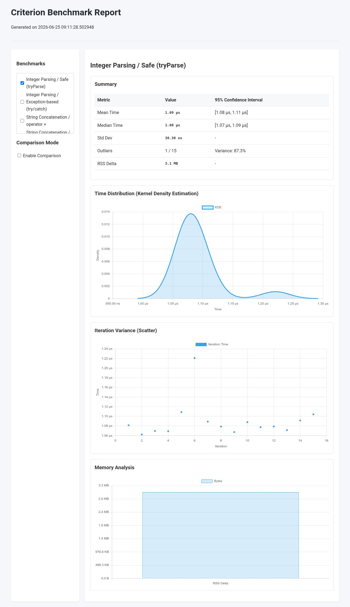
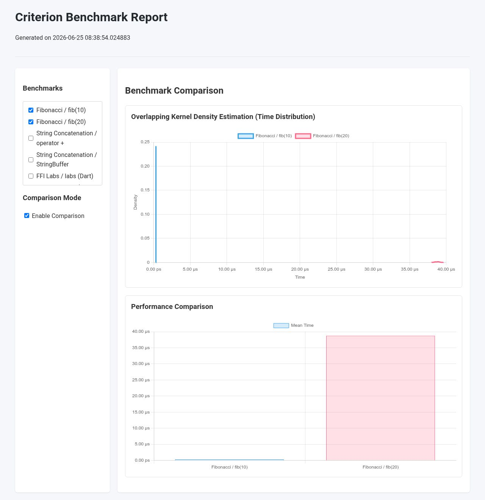

# Criterion

A statistics-driven benchmarking library for Dart, inspired by Rust's `criterion.rs`.

Criterion helps write precise benchmarks by accounting for JIT warm-up, garbage collection, and system noise.

## Features

*   **Robust Statistics**: Estimates 95% confidence intervals for mean and median using bootstrapping.
*   **Outlier Analysis**: Detects outliers and calculates their impact on variance.
*   **Adaptive Warm-up**: Automatically calibrates iterations. Supports KBSSD (Kernel-Based Steady-State Detection).
*   **Resource Tracking**: Measures allocated bytes, object counts, and RSS delta.
*   **CPU Instructions**: Counts CPU instructions on Linux (requires performance counter access).
*   **Overhead Calibration**: Subtracts baseline harness overhead (e.g., FFI boundary cost).
*   **State Isolation**: Run setup functions outside the measured loop.
*   **Throughput Tracking**: Measures performance in bytes/second or elements/second.
*   **Async Support**: Native support for asynchronous benchmarks.
*   **Interactive Reports**: Generates HTML reports with charts and exports raw JSON.

---

## Getting Started

Add `criterion` to your development dependencies:

```bash
dart pub add dev:criterion
```

---

## Usage

### Basic Benchmark

```dart
import 'package:criterion/criterion.dart';

int fib(int n) => n <= 1 ? n : fib(n - 1) + fib(n - 2);

void main() async {
  await criterion('Fibonacci', (c) {
    c.bench('fib(10)', () => fib(10));
    c.bench('fib(20)', () => fib(20));
  });
}
```

### Running Benchmarks

#### Multi-Runtime Runner (Recommended)
Run benchmarks in different execution flavors (JIT, AOT, JS, WASM):

```bash
# Run in default AOT flavor
dart run criterion:run benchmark/my_benchmark.dart

# Compare JIT and AOT
dart run criterion:run -f jit -f aot benchmark/my_benchmark.dart

# Compare JS and WASM (requires Node.js)
dart run criterion:run -f js -f wasm benchmark/my_benchmark.dart
```

Options:
*   `-f, --flavor`: `jit`, `aot`, `js`, or `wasm` (can be comma-separated or specified multiple times).
*   `--json`: Output results as JSON to stdout.
*   `--compiler-flag`: Extra flags for `dart compile`.
*   `--vm-flag`: Extra flags for Dart VM or Node.js.

#### Direct JIT Execution
```bash
dart benchmark/my_benchmark.dart
```

### Async Benchmarks
Benchmark functions can return a `Future`:

```dart
c.bench('async operation', () async {
  await someAsyncWork();
});
```

### State Isolation (Setup)
To benchmark operations that modify state (like in-place sorting) without measuring the setup time, use `setup`:

```dart
c.bench<List<int>>(
  'in-place sort',
  (list) => list.sort(),
  setup: () => List<int>.generate(1000, (i) => 1000 - i),
);
```
*Note: The benchmark function must accept the state returned by `setup`.*

### Throughput Tracking
Track performance relative to data size:

```dart
final data = Uint8List(1024 * 1024); // 1 MB
c.bench(
  'parse 1MB',
  () => parse(data),
  throughput: Throughput.bytes(data.length),
);
```

### Benchmark Variants
Compare multiple implementations of the same task:

```dart
c.variants('Fibonacci', {
  'recursive': () => fib(10),
  'iterative': () => fibIter(10),
});
```
This prints a comparison table using the first variant as the baseline and adds a comparison chart to the HTML report.

### Overhead Calibration
Subtract harness or FFI overhead using `noOp`:

```dart
c.bench(
  'strlen (1000 chars)',
  () => strlen(str1000),
  noOp: () => strlen(strEmpty),
);
```

### Preventing Dead-Code Elimination (DCE)
Compilers may optimize away pure functions if their results are unused. Pass results to `blackhole` to force execution:

```dart
c.bench('with blackhole', () {
  blackhole(pureFunction(10));
});
```

---

## Configuration

Configure the suite by passing `CriterionConfig`:

```dart
await criterion(
  'My Suite',
  (c) { ... },
  config: CriterionConfig(
    generateHtmlReport: true,
    exportJson: true,
    reportDir: 'benchmark/report',
    
    // KBSSD (Kernel-Based Steady-State Detection)
    useKbssd: true,                  // Use KBSSD adaptive benchmarking (default: true)
    kbssdWindowSize: 15,
    kbssdStabilityRequired: 8,
  ),
);
```

### KBSSD Adaptive Benchmarking
By default, Criterion uses KBSSD to detect convergence dynamically. It monitors a sliding window of measurements and stops when the variance stabilizes, saving time for fast-converging benchmarks while ensuring stability for noisy ones. You can disable it by setting `useKbssd: false` in the configuration.

---

## Comparing Results

### Comparing JSON Files
Compare two saved JSON reports:

```bash
dart run criterion:compare before.json after.json
```
Prints a Markdown table comparing time, memory, and instructions, with statistical significance checks.

### Git Reference Comparison
Automate comparison between two Git references (commits, branches, or tags):

```bash
dart run criterion:compare_git main feature-branch benchmark/my_benchmark.dart
```
This checks out both references to temporary worktrees, runs the benchmarks, and outputs the comparison.

---

## Sample HTML Reports

### Single Benchmark View


### Comparison View


---

## Instruction Counting on Linux

Requires performance counter access:

```bash
sudo sysctl kernel.perf_event_paranoid=1
```

To make it persistent, add to `/etc/sysctl.conf`:
```text
kernel.perf_event_paranoid=1
```

---

## License

Apache License, Version 2.0. See [LICENSE](LICENSE).

---

## Disclaimer

This is not an official Google product.

