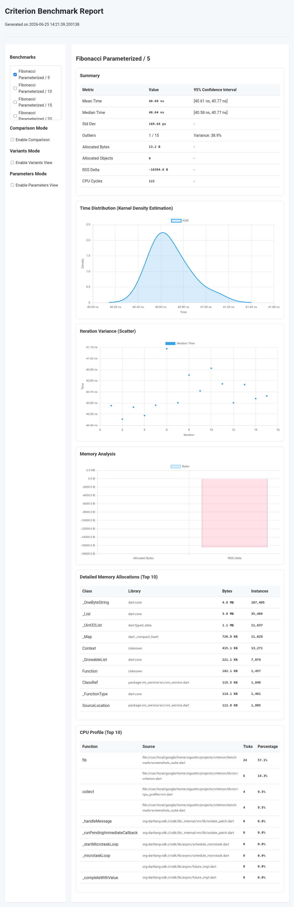
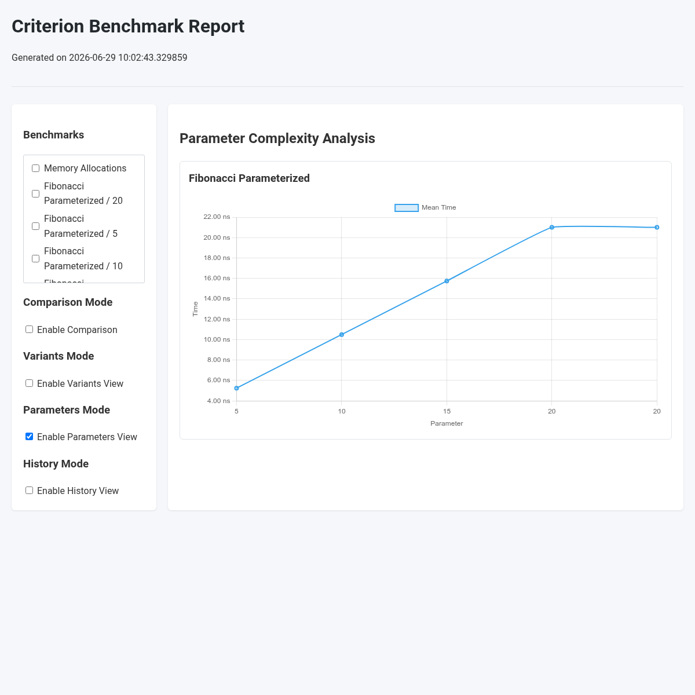
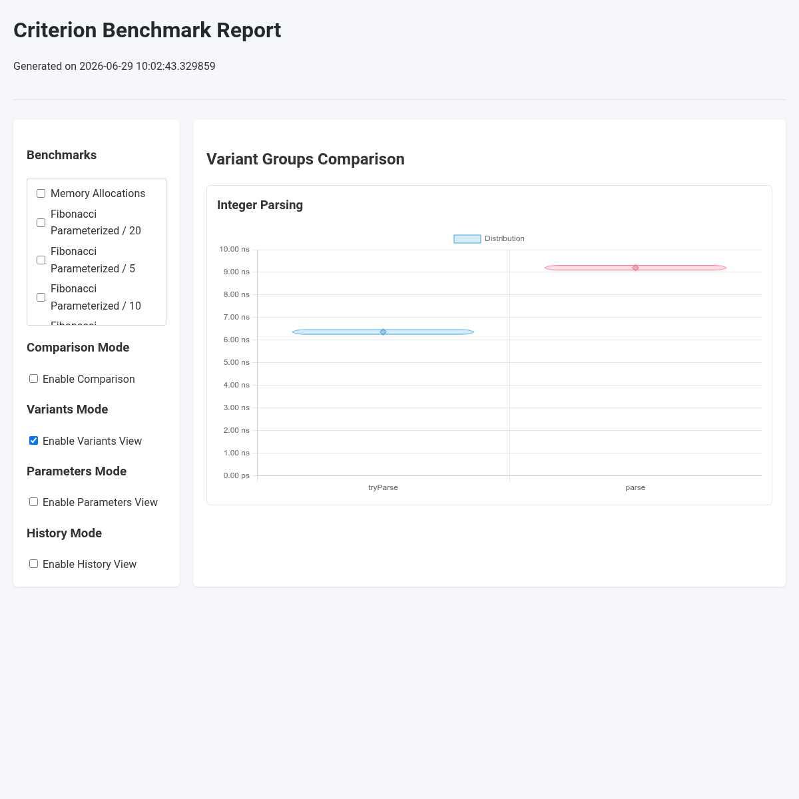
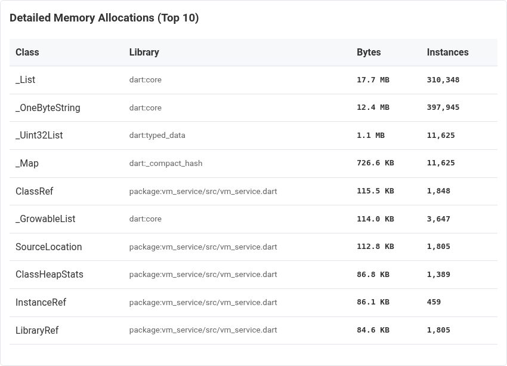
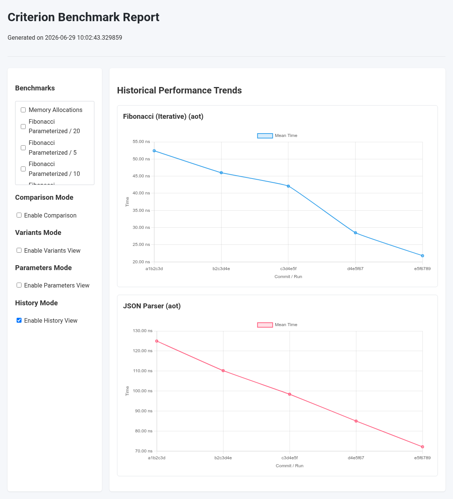
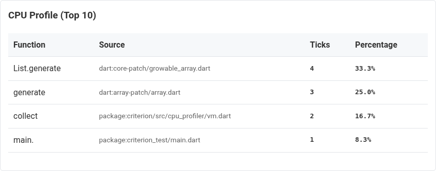

# Criterion

A statistics-driven benchmarking library for Dart, inspired by Rust's `criterion.rs`.

Criterion helps write precise benchmarks by accounting for JIT warm-up, garbage collection, and system noise.

## Features

*   **Robust Statistics**: Estimates 95% confidence intervals for mean and median using bootstrapping.
*   **Outlier Analysis**: Detects outliers and calculates their impact on variance.
*   **Adaptive Warm-up**: Automatically calibrates iterations. Supports KBSSD (Kernel-Based Steady-State Detection).
*   **Parameterization**: Run the same benchmark over a range of inputs and plot complexity.
*   **Resource Tracking** (opt-in): Measures allocated bytes, object counts, RSS delta, and **detailed class-level allocations**.
*   **CPU Cycles** (opt-in): Counts CPU cycles using hardware performance counters (FFI-based).
*   **CPU Instructions** (opt-in): Counts CPU instructions on Linux (requires performance counter access).
*   **CPU Profiling**: Optional CPU sampling profiling with Dart DevTools integration.
*   **Historical Tracking**: Local database to detect regressions automatically.
*   **Overhead Calibration**: Subtracts baseline harness overhead (e.g., FFI boundary cost).
*   **State Isolation**: Run setup functions outside the measured loop.
*   **Throughput Tracking**: Measures performance in bytes/second or elements/second.
*   **Async Support**: Native support for asynchronous benchmarks.
*   **Interactive Reports**: Generates HTML reports with charts (line, bar, violin, KDE, scatter) and exports raw JSON.

---

## Getting Started

Add `criterion` to your development dependencies:

```bash
dart pub add dev:criterion
```

---

## Usage

### Basic Benchmark

```dart
import 'package:criterion/criterion.dart';

int fib(int n) => n <= 1 ? n : fib(n - 1) + fib(n - 2);

void main() async {
  await criterion('Fibonacci', (c) {
    c.bench('fib(10)', () => fib(10));
    c.bench('fib(20)', () => fib(20));
  });
}
```

### Running Benchmarks

#### Multi-Runtime Runner (Recommended)
Run benchmarks in different execution flavors (JIT, AOT, JS, WASM):

```bash
# Run in default AOT flavor
dart run criterion:run benchmark/my_benchmark.dart

# Compare JIT and AOT
dart run criterion:run -f jit -f aot benchmark/my_benchmark.dart

# Compare JS and WASM (requires Node.js)
dart run criterion:run -f js -f wasm benchmark/my_benchmark.dart
```

#### `criterion:run` options

| Option | Description |
| --- | --- |
| `-f, --flavor` | Runtime flavor: `jit`, `aot`, `js` or `wasm`. Repeatable or comma-separated. Defaults to `aot`. |
| `--json` | Print the aggregated results as JSON on stdout instead of the human-readable report. |
| `--compiler-flag` | Extra flag for `dart compile`. Repeatable. |
| `--vm-flag` | Extra flag for the Dart VM (`jit`) or Node (`js`, `wasm`). Repeatable. |
| `-k, --filter` | Run only benchmarks whose name matches this regular expression. |
| `-q, --quick` | Fast pass: 10 samples, 50 ms warm-up, KBSSD off and all non-timing metrics off. |
| `--samples` | Override the number of samples collected per benchmark. |
| `--warmup-time` | Override the warm-up duration, in milliseconds. |
| `--no-html` | Do not generate the HTML report. |
| `--memory` | Measure allocations. Adds an extra run of every benchmark function. |
| `--instructions` | Measure hardware instructions (Linux, see below). Adds an extra run. |
| `--cycles` | Measure CPU cycles. Adds an extra run. |
| `--all-metrics` | Shorthand for `--memory --instructions --cycles`. |
| `--no-memory` | Skip allocation measurement even if the suite's config enables it. |
| `--no-instructions` | Skip instruction measurement even if the suite's config enables it. |
| `--no-cycles` | Skip cycle measurement even if the suite's config enables it. |
| `--timing-only` | Skip all three extra measurement passes. |
| `--save-baseline` | Save this run as a named baseline. See [Named baselines](#named-baselines). |
| `--baseline` | Compare this run against a previously saved named baseline. |
| `--fail-on-regression` | Exit with a non-zero exit code when a regression is detected. |
| `--noise-threshold` | Relative change below which a difference counts as noise (default `0.01`, i.e. 1%). |

The measurement flags combine with the suite's own `CriterionConfig`: `--memory`,
`--instructions`, `--cycles` and `--all-metrics` add to what the config asks
for, the `--no-*` flags and `--timing-only` remove from it, and `--quick`
overrides everything by turning all of them off.

If no benchmark file is given, every `.dart` file under `benchmark/` containing
a `main(` is run.

#### Direct JIT Execution
```bash
dart benchmark/my_benchmark.dart
```

### Async Benchmarks
Benchmark functions can return a `Future`:

```dart
c.bench('async operation', () async {
  await someAsyncWork();
});
```

### State Isolation (Setup)
To benchmark operations that consume or modify their input (like in-place sorting) without measuring the setup time, use `benchState`:

```dart
c.benchState<List<int>>(
  'in-place sort',
  (list) => list.sort(),
  setup: () => List<int>.generate(1000, (i) => 1000 - i),
);
```
`setup` runs outside the measured region and produces one fresh state per iteration; the benchmark function receives it. The state type is inferred from `setup`, so a mismatched benchmark function is a compile error.

### Batched Setups (`batchSize`)
When a benchmark uses `setup` to generate large objects or buffers, pre-allocating all benchmark iterations in memory simultaneously can cause RAM exhaustion (O(iterations) memory) and CPU cache eviction.

Criterion supports **Batched Setups** via the optional `batchSize` parameter (defaulting to `BatchSize.smallInput`—batches of 1000—when `setup` is provided):

```dart
// For large allocating setups (e.g. huge buffers or FFI matrices),
// BatchSize.largeInput allocates 1 state per batch start/stop.
c.benchState<List<double>>(
  'mutate large matrix',
  (matrix) => mutate(matrix),
  setup: () => List<double>.filled(100000, 1.0),
  batchSize: BatchSize.largeInput, // Or BatchSize.numIterations(n)
);
```

Available batch modes in `BatchSize`:
* `BatchSize.smallInput`: Batches of 1000 iterations (default when `setup` is provided). Ideal for primitives or small structs with minimal stopwatch start/stop overhead (< 0.2 ns/iter).
* `BatchSize.largeInput` / `BatchSize.perIteration`: Batches of 1 iteration. Ideal for heavy allocations.
* `BatchSize.unbatched` / `BatchSize.all`: Allocates all iterations upfront in a single unbatched pass.
* `BatchSize.numIterations(n)`: Custom batch size of `n` iterations.

### Throughput Tracking
Track performance relative to data size:

```dart
final data = Uint8List(1024 * 1024); // 1 MB
c.bench(
  'parse 1MB',
  () => parse(data),
  throughput: Throughput.bytes(data.length),
);
```

### Benchmark Variants
Compare multiple implementations of the same task:

```dart
c.variants('Integer Parsing', {
  'tryParse': () => int.tryParse('123'),
  'parse': () => int.parse('123'),
});
```

Use `variantsState` when the variants need freshly constructed input:

```dart
c.variantsState<List<int>>('Sorting', {
  'sort': (list) => list.sort(),
  'sorted copy': (list) => List.of(list)..sort(),
}, setup: () => List<int>.generate(1000, (i) => 1000 - i));
```
This prints a comparison table using the first variant as the baseline and adds a comparison chart to the HTML report.

### Parameterization (Value Benchmarking)

Run the same benchmark over a range of inputs (e.g., to verify algorithmic complexity):

```dart
c.benchWith<int>(
  'Fibonacci Parameterized',
  [5, 10, 15, 20],
  (n) => fib(n),
);
```

Use `benchWithState` when each parameter also needs freshly constructed state; the benchmark function then receives both:

```dart
c.benchWithState<List<int>, int>(
  'Sort by size',
  [100, 1000, 10000],
  (list, size) => list.sort(),
  setup: (size) => List<int>.generate(size, (i) => size - i),
);
```

This groups the results in the report and generates a **Time vs. Parameter Value** line chart in the HTML report.

### CPU Profiling

Enable CPU profiling to identify bottlenecks:

```dart
await criterion('My Suite', (c) {
  c.bench('my-bench', () => work());
}, config: CriterionConfig(
  cpuProfiling: true, // Enable CPU profiling (adds overhead)
));
```

When enabled, Criterion will:
1. Print the top CPU-consuming functions in the console.
2. Add a CPU Profile table to the HTML report.
3. Export a raw Dart VM CPU profile to `<reportDir>/profiles/<name>.cpuprofile.json`. You can load this file into **Dart DevTools** (CPU Profiler tab) for full flamegraph analysis.

### Overhead Calibration
Subtract harness or FFI overhead using `noOp`:

```dart
c.bench(
  'strlen (1000 chars)',
  () => strlen(str1000),
  noOp: () => strlen(strEmpty),
);
```

### Preventing Dead-Code Elimination (DCE)
Compilers may optimize away pure functions if their results are unused. Pass results to `blackhole` to force execution:

```dart
c.bench('with blackhole', () {
  blackhole(pureFunction(10));
});
```

---

## Configuration

Configure the suite by passing `CriterionConfig`:

```dart
await criterion(
  'My Suite',
  (c) { ... },
  config: CriterionConfig(
    generateHtmlReport: true,
    exportJson: true,
    reportDir: 'benchmark/report',

    // Extra measurement passes (all off by default)
    measureMemory: true,
    measureInstructions: true,
    measureCycles: true,

    // KBSSD (Kernel-Based Steady-State Detection)
    useKbssd: true,                  // Use KBSSD adaptive benchmarking (default: true)
    kbssdWindowSize: 15,
    kbssdStabilityRequired: 8,
  ),
);
```

### Measuring more than time

A default run measures time only. Allocation counts, hardware instruction
counts and CPU cycle counts each require running every benchmark function an
extra time, which multiplies the wall-clock cost of a suite, so they are
opt-in.

Enable them in `CriterionConfig` as above, or from the command line:

```bash
dart run criterion:run benchmark/ --all-metrics   # memory + instructions + cycles
dart run criterion:run benchmark/ --memory        # just allocations
```

`--no-memory`, `--no-instructions`, `--no-cycles` and `--timing-only` still
work and override whatever the suite's own config asks for, so you can strip a
suite back to timing without editing it. On Linux, `--instructions` and
`--cycles` use hardware PMU counters (`PERF_COUNT_HW_INSTRUCTIONS` and
`PERF_COUNT_HW_CPU_CYCLES` via `perf_event_open`); on macOS, Windows, or
restricted Linux environments without PMU access, `--cycles` falls back to
user-space hardware counter registers (`__rdtscp` on x86_64, `cntvct_el0` on
ARM64). See [`criterion:run` options](#criterionrun-options) for the full list.

### KBSSD Adaptive Benchmarking
By default, Criterion uses KBSSD as an **adaptive warm-up**. It monitors a sliding window of measurements and waits until the "past" and "present" windows become statistically indistinguishable — that is, until the benchmark has reached a steady state and the JIT, caches and allocator have settled.

Those detection measurements are discarded. Once steady state is reached (or `kbssdMaxSamples` measurements have been spent trying), Criterion collects a fresh set of `samples` measurements and reports statistics on those. So `samples` means the same thing whether KBSSD is on or off; KBSSD only decides *when* sampling starts.

Convergence is declared when either:
* the Maximum Mean Discrepancy between the two windows falls to at most `kbssdScaleFactor` times the MMD expected from sampling noise alone (estimated by permuting the observed measurements), or
* the relative standard error of the mean of the present window is within 3%,

for `kbssdStabilityRequired` consecutive measurements.

You can disable KBSSD by setting `useKbssd: false`, in which case Criterion falls back to a fixed `warmupDuration` followed by `samples` measurements.

---

## Comparing Results

### Comparing JSON Files
Compare two saved JSON reports:

```bash
dart run criterion:compare before.json after.json
```
Prints a Markdown table comparing time, memory, and instructions, with statistical significance checks.

### Named baselines

A named baseline is a snapshot of one run that you can compare against later,
without checking anything in or recompiling the suite. Save one, change the
code, then compare:

```bash
# Snapshot the current state under the name "before".
dart run criterion:run benchmark/my_benchmark.dart --save-baseline before

# ... edit the code ...

# Compare the new run against that snapshot.
dart run criterion:run benchmark/my_benchmark.dart --baseline before
```

Baselines are stored as `<historyFile directory>/baselines/<name>.json`, so with
the default `historyFile` that is `benchmark/baselines/before.json`. A name may
only contain letters, digits, underscores and hyphens. Saving to an existing
name overwrites it.

When `--baseline` is given, the named baseline replaces the rolling history as
the reference for regression detection: every benchmark is compared against its
counterpart in the baseline, and differences smaller than `--noise-threshold`
(default 1%) are ignored. Add `--fail-on-regression` to make the run exit with a
non-zero exit code when a regression survives that threshold, which is what you
want in CI:

```bash
dart run criterion:run benchmark/ --baseline main --fail-on-regression --noise-threshold 0.02
```

Both options are also available on `CriterionConfig` as `saveBaseline` and
`baseline`; the command-line flags win when both are set.

### Git Reference Comparison
Automate comparison between two Git references (commits, branches, or tags):

```bash
dart run criterion:compare_git main feature-branch benchmark/my_benchmark.dart
```
This checks out both references to temporary worktrees, runs the benchmarks, and outputs the comparison.

### Historical Tracking & Regression Detection

Criterion can keep a history of benchmark runs to detect performance regressions automatically.

Configure it in your suite:

```dart
await criterion('My Suite', (c) { ... }, 
  config: CriterionConfig(
    checkRegressions: true, // Enable regression checks against history
    historyFile: 'benchmark/criterion_history.json', // Custom history file path
  ),
);
```

When `checkRegressions` is enabled, Criterion compares the current run against the latest historical baseline using a two-sample bootstrap test on the mean difference, controlled for multiple comparisons across the suite via the Benjamini–Hochberg false discovery rate (FDR) procedure ($\alpha = 0.05$) and filtered by `noiseThreshold` (default 1%). If a benchmark is statistically significantly slower beyond the noise threshold, it prints a warning:

```text
  WARNING: Regression detected!
  Mean time increased by +24.5% (from 10.2ns to 12.7ns)
```

#### Workflows

There are three main workflows for managing baseline history and regression checks:

##### 1. Local Cache (Default)
Keep the history file local to track your development progress.
*   **Setup**: Add `benchmark/criterion_history.json` to your `.gitignore`.
*   **How it works**: Every local run is appended to the history. The next run is automatically compared against your last run. The baseline shifts forward automatically.

##### 2. Dynamic Git Comparison (Recommended for CI)
If you want regression checks in CI but don't want to commit a baseline file to your repository.
*   **Command**:
    ```bash
    dart run criterion:compare_git main feature-branch benchmark/my_benchmark.dart
    ```
*   **How it works**: CI runs the benchmark twice: once on `main` and once on the feature branch, then compares the results.

##### 3. Checked-in "Golden" Baseline (Fastest CI)
If your benchmarks are slow, running them twice in CI might be too expensive. You can check in a "golden" baseline to compare against.
*   **Setup**: Check `benchmark/criterion_history.json` into Git.
*   **Config**: Configure your suite to only export history when not in CI:
    ```dart
    final isCI = Platform.environment['CI'] == 'true';
    final config = CriterionConfig(
      checkRegressions: true,
      exportHistory: !isCI, // Do not append new runs in CI
    );
    ```
*   **Updating the Baseline**: When you intentionally change performance (e.g., merge an optimization or an accepted regression), update the baseline:
    1. Delete the local `benchmark/criterion_history.json`.
    2. Run the benchmark on `main` (generates a fresh history containing only the new baseline).
    3. Commit the updated file.

#### Historical Performance Trend Charts & CLI Tool

Criterion automatically captures Git commit metadata (commit hash, message, timestamp) whenever benchmarks run. You can visualize performance timelines across commits in two ways:

##### 1. Interactive HTML Report
When history tracking is enabled (`exportHistory: true` or `checkRegressions: true`), the HTML report provides timeline visualizations:
*   **Global History View**: Enable **History View** in the sidebar (or load the report with `?history=true`) to view interactive performance trend line charts across commits for all benchmarks in your suite.
*   **Single Benchmark Detail**: When viewing an individual benchmark on the main dashboard, a **Performance Over Time (Commits)** line chart automatically displays its execution history.

##### 2. CLI Trend Tool (`criterion:graph`)
You can generate Markdown trend tables and standalone historical HTML reports directly from the CLI:

```bash
dart run criterion:graph --history benchmark/criterion_history.json --output benchmark/report
```

Options:
*   `-h, --history`: Path to the historical JSON file (defaults to `benchmark/criterion_history.json`).
*   `-o, --output`: Output directory for the generated HTML report (defaults to `benchmark/report`).

### Programmatic Regression Testing

You can write standard Dart tests that fail if a performance regression is detected, comparing a newly generated results file against a checked-in "golden" file.

Exposed APIs:
*   `loadResults(String jsonString)`: Parses a list of `BenchmarkResult`s.
*   `compareResults(List<BenchmarkResult> baseline, List<BenchmarkResult> current)`: Compares two runs.
*   `SuiteComparison.regressions`: Returns a list of benchmarks that regressed significantly.
*   `formatResults(List<BenchmarkResult> results)`: Serializes results to pretty JSON.

Example `test/benchmark_regression_test.dart`:

```dart
import 'dart:io';
import 'package:criterion/criterion.dart';
import 'package:test/test.dart';

void main() {
  test('Check for performance regressions', () {
    final goldenFile = File('benchmark/golden.json');
    final currentFile = File('benchmark/report/results.json');

    if (!goldenFile.existsSync()) {
      fail('Golden baseline file not found. Run with update-golden to generate.');
    }
    if (!currentFile.existsSync()) {
      fail('Current results not found. Run benchmarks first.');
    }

    final baseline = loadResults(goldenFile.readAsStringSync());
    final current = loadResults(currentFile.readAsStringSync());

    final comparison = compareResults(baseline, current);

    if (comparison.regressions.isNotEmpty) {
      final message = StringBuffer('Performance regressions detected:\n');
      for (final r in comparison.regressions) {
        message.writeln(
          '- ${r.name}: '
          '${Benchmark.formatDuration(r.time.before)} -> '
          '${Benchmark.formatDuration(r.time.after)} '
          '(${r.time.percentDiff.toStringAsFixed(1)}%)'
        );
      }
      fail(message.toString());
    }
  });
}
```

To update the golden file, you can create a helper script (or add a flag to your test runner) that writes the current results to the golden path:

```dart
// tool/update_golden.dart
import 'dart:io';
import 'package:criterion/criterion.dart';

void main() {
  final currentFile = File('benchmark/report/results.json');
  final goldenFile = File('benchmark/golden.json');
  
  final results = loadResults(currentFile.readAsStringSync());
  goldenFile.writeAsStringSync(formatResults(results));
  print('Golden updated successfully.');
}
```

---

## Sample HTML Reports

### Dashboard


### Parameterized Complexity Chart


### Variants Comparison (Violin Plot)


### Detailed Memory Profiling


### Historical Performance Trend Timeline


### CPU Profiling


---

## Instruction Counting on Linux

Requires performance counter access:

```bash
sudo sysctl kernel.perf_event_paranoid=1
```

To make it persistent, add to `/etc/sysctl.conf`:
```text
kernel.perf_event_paranoid=1
```

---

## License

Apache License, Version 2.0. See [LICENSE](LICENSE).

---

## Disclaimer

This is not an official Google product.

